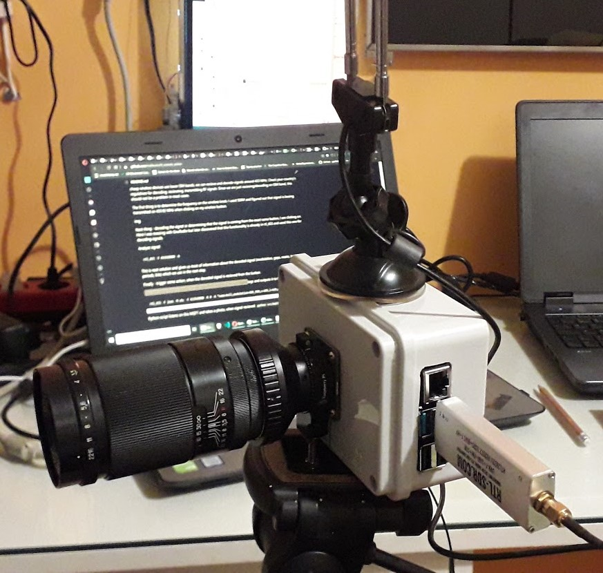
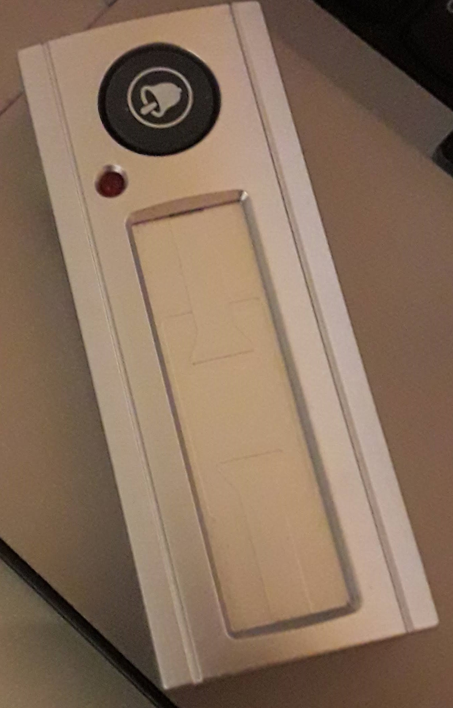
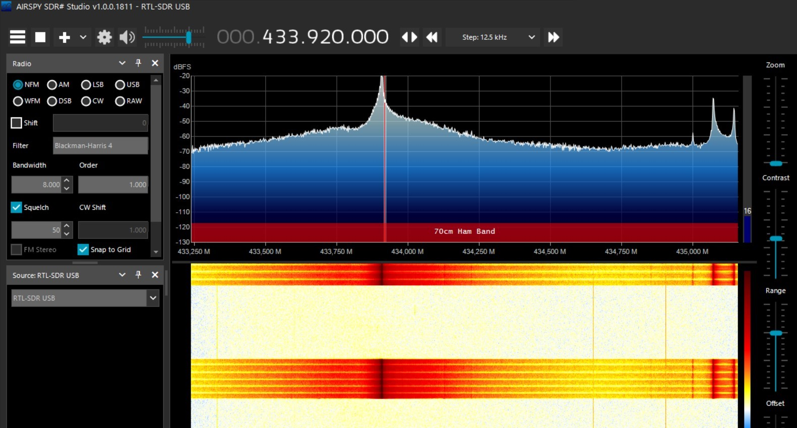
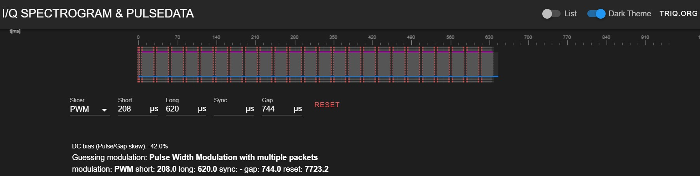

# RTL Remote Action

Mini project made using [rtl_433](https://github.com/merbanan/rtl_433) with modified example code.

The idea is to use not so smart devices (e.g. wireless bell ring button in my case) for RF communication with computer to do some task.
The result in my case is to use wireless bell ring button to take a photo on Raspberry Pi's camera module via RTL-SDR. Sure, it would be easier to take photo using mobile phone over the wifi, here is just an example to show that this is possible with differet equipment. 

Equipment used:
* Raspberry Pi 4
* Rapsberry Pi HQ Camera module
* RTL-SDR with antenna
* "dumb" wireless bell ring knob (433 MHz)

Software used:
* [rtl_433](https://github.com/merbanan/rtl_433)
* mqtt service

```
sudo apt update
sudo apt install -y mosquitto mosquitto-clients
sudo systemctl enable mosquitto.service
```

Setup






## Research

With cheap RTL-SDR dongle you can recieve radio frequency signals from around 24 MHz - 1.7 GHz and since most of cheap wireless devices use lower ISM bands, we can recieve and decode signals around 433 MHz.
Check your country's regulatives for decoding, recieveing, transmitting RF signals. Since we are just recieving/decoding on ISM band, this should not be a problem in most cases.

The first thing is to determine the frequency on the wireless knob. I used SDR# and figured out that signal is beeing transmitted on 433.92 MHz when clicking on my wireless button.



Next thing - decoding the signal or determining that the signal is coming from the exact same button, I am clicking on.
Here I was messing with GnuRadio but later discovered that this functionality is already in rtl_433 and used this one for decoding signals.

Analyze signal:

```
rtl_433 -f 433920000 -A
```
This is neat solution and gives us most of information about the decoded signal (modulation, gaps, resets, timings, periods, bits) which we use in the next step.




Finally - trigger some action, when the decoded signal is recieved from the button.

This command starts a listener on the specified frequency for our signal tags and outputs it to the MQTT service:
```
rtl_433 -F json -M utc -f 433920000 -R 0 -X "name=bell,modulation=OOK_PWM,s=208,l=620,g=6436,reset=1000000,rows>=20,match={25}xxxxxxxx" | mosquitto_pub -t home/rtl_433 -l
```

Python script listens on this MQTT and takes a photo, when signal recieved:
```
python src/mqtt_remote_action.py
```
